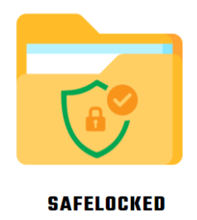

# Protector de archivos con contraseña

    

## Instrucciones:
1. Realiza un FORK del repositorio de Protector de archivos con contraseña
2. CLONA ese repositorio a tu máquina local `git clone [TU_REPOSITORIO]`
3. Crea un entorno virtual con `python -m venv venv` y actívalo con `source venv/bin/activate` (Linux/Mac) o `venv\Scripts\activate` (Windows)
4. Instala las dependencias y librerías con `pip install -r requirements.txt`
5. Crea una nueva rama `git checkout -b [NOMBRE_RAMA]`
6. Contrinuye con los cambios según la tarea asignada.
7. Sube tus cambios a tu repositorio con `git add .`, `git commit -m "Mensaje del commit"` y `git push origin [NOMBRE_RAMA]`
8. Crea un Pull Request (PR) desde tu repositorio hacia el repositorio original.